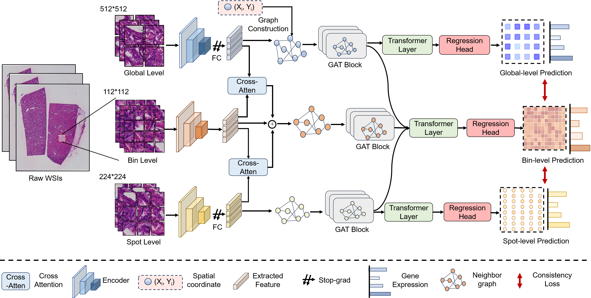
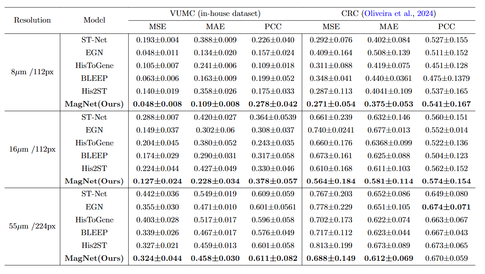

# MagNet

This project consists of models of our newly-proposed MagNet, which is a multi-level attention graph network designed for accurate prediction of high-resolution HD spatial transcriptomics data.

- MagNet integrates information across multiple resolutions, including the bin, spot, and region levels, through cross-attention layers. It also extracts and combines features from neighboring regions with Graph Attention Network (GAT) and Transformer layers. 
- Thus, our proposed framework overcomes the information bottleneck posed by low-resolution inputs when predicting high-resolution, high-dimensional gene expression by efficient extraction and integration of multisource and multilevel features. 
- Furthermore, the model incorporates cross-resolution constraints on gene expression within the same region, further enhancing its performance in HD gene expression prediction.




## Implementation

- To prepare the multi-resolution data format for MagNet, run files in folder `data_preprocessing`:

  ```bash
  python 1_cropped_multi_patches.py
  ...
  python 6_make_dataset.py
  ```

- To conduct 4-fold validation, run:

  ```bash
  python train.py --root_path '' --base_lr 0.005 --gpu '' --level '16' --batch_size 256
  ```

## Experiment

We tested our dataset and CRC dataset on multiple models at three resolutions and provided a list of baselines here.

